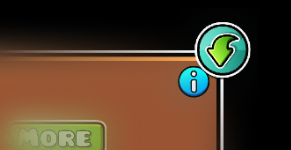

# Song Export
Export custom GD song with a single button, *ig idk*

Adds song export button for saving custom song to any directory with single button

# Issues

<strong>Currently not working with Jukebox NONG's and vanilla soundtrack</strong>

Please, report any mod issues to the [Github repository](https://github.com/IsotonicBunk/SongExport/issues)